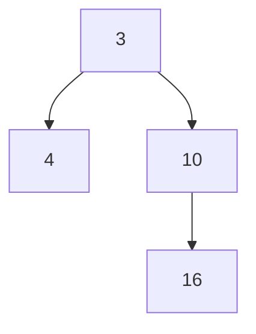
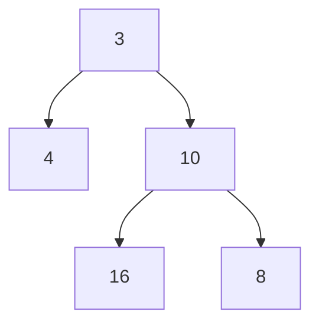
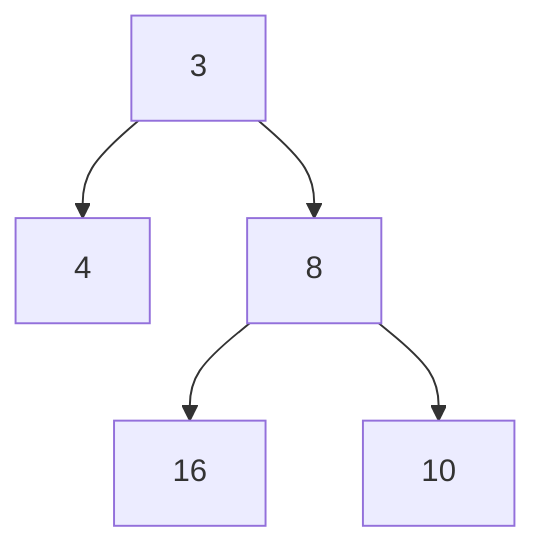
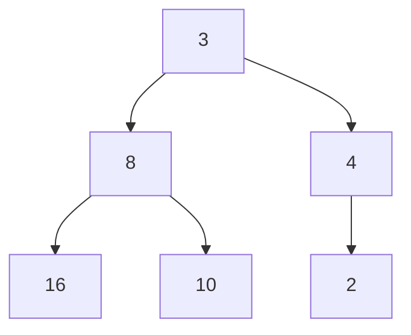

# Heaps and Priority Queues

## Overview

This is a "warmup" project, and covers material you should have
learned in CMSC132 and CMSC351. The goals are to ensure that you are:

 * familiar with the basic data structures on which we will
   build,
 * able to navigate git, and
 * able to upload your code to the submit server.
 
Please note that, per the syllabus, we **do not** accept late
submissions without an approved reason for an extension. This is
different than what you might be used to from other classes, so
ensure that you know what the deadline is on the submit server.

You will need to implement four classes:

 * `LinkedMinHeap.java`
 * `ArrayMinHeap.java`
 * `LinearPriorityQueue.java`
 * `MinHeapPriorityQueue.java`
 
If you are reading this on Gitlab, you will need to clone your own
copy. There are two ways to do this:

 1. You can simply clone this repository using either the HTTPS or SSH urls, or
 2. You can first create a personal fork, and clone that.
 
The second option is better, because you can then push your changes back to Gitlab, which means you now have a remote backup. This has several advantages:

 * If you ask a question on the discussion forum, we can see your
   code and provide a more precise response.
 * If your computer dies (which is going to happen to at least one
   person this semester, probably more), you have only lost the work
   you did since your last push.
 * If you want to work on multiple machines, it's as easy as pushing
   from one and pulling on the other. This is why git exists in the
   first place.

The starter code is in the `src/` directory, with the actual project
code in `src/pqueue/`. There is also JavaDoc in the `doc/` directory.
The code you need to modify is in `src/pqueue/heaps/` and
`src/pqueue/priorityqueues/`. You are welcome to add more directories,
files, and classes if you wish, but you are not required to.

## Prerequisites

We expect you to be familiar with Binary Search Trees, Stacks, Lists,
FIFO queues and programming in Java. Skills harnessed by a typical
UMD freshman course such as CMSC 131/132 are more than sufficient.
You will need to remind yourselves of what a binary heap is and how
insertions and min-deletions work, as well as the ways in which they
can be represented in computer memory. The structure and operation of
heaps are briefly touched upon in the next section.

In this class, we do not aim to test your programming, OOP or Java
expertise. We want to teach you Data Structures. However, a minimal
amount of familiarity with certain OOP/Java constructs will be
required. You would probably benefit from ensuring that you understand
the basics of Iterators and checked Exceptions. You should also be
familiar with what an interface is, what an anonymous inner class is,
how it differs from a functional interface, etc.

## A Brief Review of Heaps and Priority Queues

While we assume you are already familiar with these structures, we
will present a brief review, to refresh your memory.

### Heaps

A *heap* is a complete binary tree (but *not* a complete binary search
tree). Insertions occur at the "rightmost" unoccupied space at the
leaf level. For example, in the diagram

we would add the next element below 10, to the right of 16. Let's
say we add 8 as the next value. This would then yield

However, heaps have another invariant: the subtree below an element
contains only elements that are greater than or equal to its value.
Because 8 is less than its parent 10, we need to *percolate* it
upwards.

8 is now less than or equal to all of the elements below it, and
greater than its parent 3. If we were now to insert 2, it would
become the first child of 4 (since the subtree under 8 is complete).

Again, this element is less than its parent (4), so it needs to
percolate upwards.

2 is still less than its parent (3), so we have to percolate again

